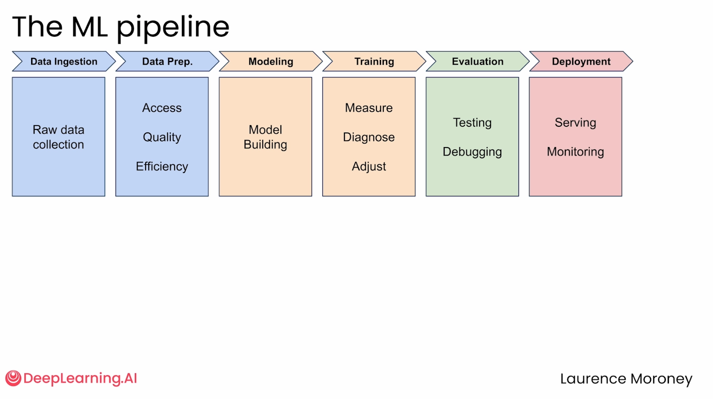

# Pytorch-Playground

This repository contains an introductory PyTorch lab focusing on building a simple neural network. It models a practical delivery scenario where a single neuron is trained to predict delivery times based on distances.

## The ML Pipeline

The project walks through the core stages of the Machine Learning Pipeline:

1. **Data Ingestion & Preparation**: Setting up tensors containing data from past deliveries (distances vs. times).
2. **Model Building**: Constructing a simple linear model (`nn.Linear(1, 1)`) using PyTorch.
3. **Training**: Training the model using Stochastic Gradient Descent (`optim.SGD`) and Mean Squared Error (`nn.MSELoss`).
4. **Prediction**: Making a data-driven decision utilizing the weights and biases learned by the model.
5. **Evaluation**: Testing the linear model against more complex, non-linear reality (mixing bike and car deliveries).

## Repository Structure

- `C1_M1_Lab_1_simple_nn.ipynb`: A step-by-step Jupyter Notebook containing the data preparation, PyTorch training loop, and model evaluation.
- `helper_utils.py`: A utility Python script providing visualization functions (`plot_results` and `plot_nonlinear_comparison`) utilizing `matplotlib` to graph the model's predictions against actual data.

## Getting Started

To run the notebook, ensure you have the following installed:
- Python 3.x
- `torch`
- `matplotlib`
- `jupyter` / `ipykernel`